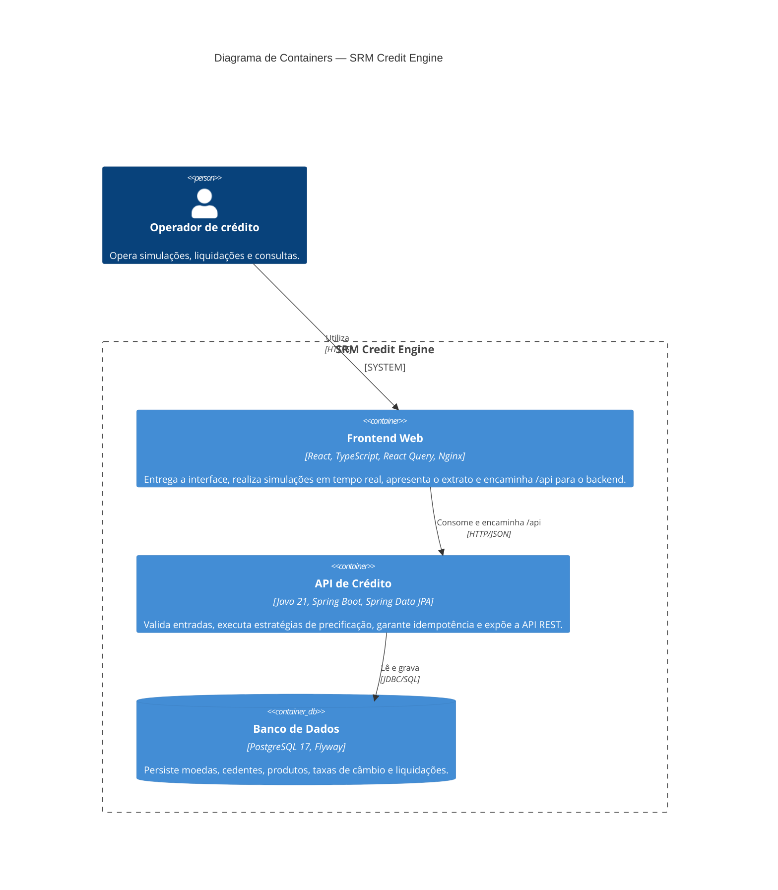

# C4 — Nível 2: Containers

Este diagrama abre o SRM Credit Engine e apresenta suas unidades executáveis e seus relacionamentos.

## Responsabilidades

| Container | Responsabilidade principal | Porta no Docker Compose |
|---|---|---:|
| Aplicação Web / Nginx | Interface, estado remoto, arquivos estáticos e proxy reverso | `3000` |
| API de Crédito | Regras de negócio, validação, precificação e liquidação | `8080` |
| PostgreSQL | Persistência relacional e integridade referencial | `5432` |

O Docker Compose constrói e orquestra os três serviços implantáveis: `frontend` (React compilado e servido pelo Nginx), `backend` e `postgres`. O Vite é utilizado no desenvolvimento e no processo de build; não é um container separado em produção.
