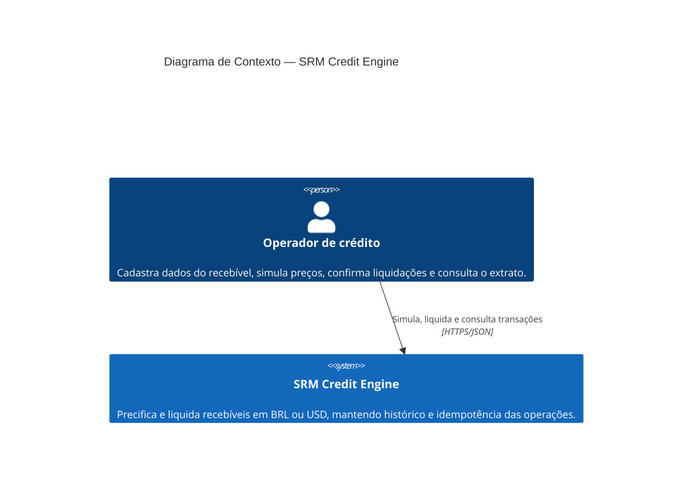

# C4 — Nível 1: Contexto

Este diagrama apresenta o SRM Credit Engine como uma única caixa e identifica quem o utiliza e qual valor o sistema entrega.

## Escopo

- O operador informa valor de face, vencimento, tipo do recebível, moedas e taxa-base.
- O sistema calcula o valor líquido segundo a estratégia do produto e a taxa de câmbio vigente.
- O sistema registra a liquidação uma única vez por chave de idempotência.
- O operador consulta o histórico com filtros, ordenação e paginação.

Não há, na implementação atual, integração automática com provedores externos. As taxas cambiais são cadastradas pela própria API.
