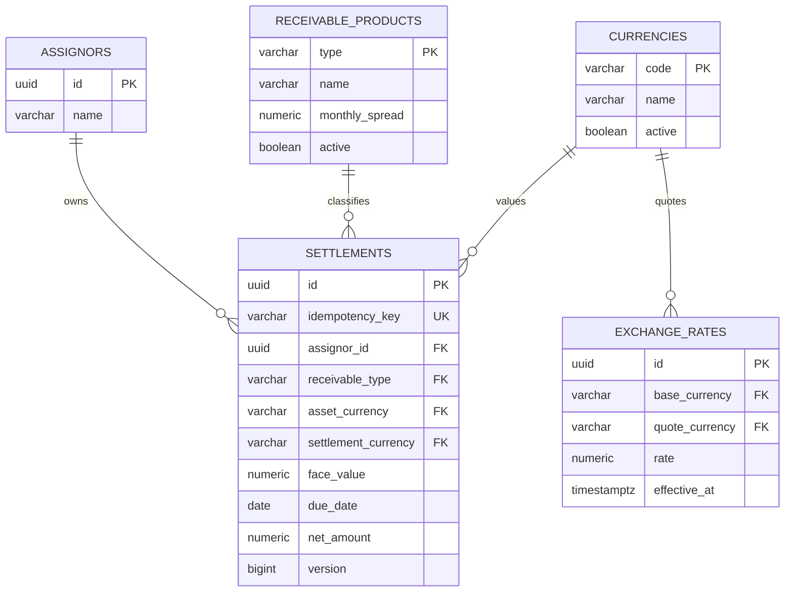

# Diagrama Entidade-Relacionamento

`settlements` referencia o cedente, o produto do recebível e duas moedas: a moeda do ativo e a moeda de liquidação. `exchange_rates` também possui dois relacionamentos com `currencies`: moeda-base e moeda-cotada.

Os campos `spread_monthly` e `exchange_rate` continuam gravados na liquidação como fotografia das condições utilizadas no cálculo. Assim, alterações futuras no cadastro do produto ou nas cotações não modificam o histórico financeiro.

O Flyway cria e popula as tabelas de referência antes de adicionar as chaves estrangeiras. Dessa forma, instalações que já possuem liquidações ou cotações são migradas sem perda de dados.
